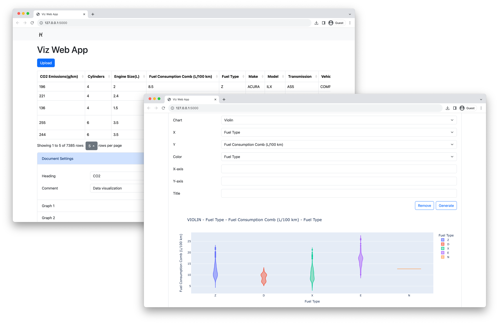

# VIZ APP



- A simple web application for data visualization
- Output preview: https://hckkiu.github.io/viz-app/output/

## Installation

### Clone the repo
```
git clone https://github.com/hckkiu/viz-app.git
```

### Enter the directory
```
cd viz-app
```

### Install packages
```
pip install -r requirements.txt
```

### Play around!
```
python run.py
```